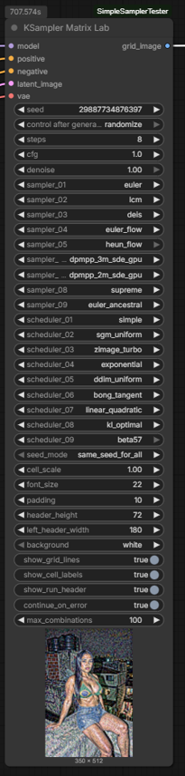
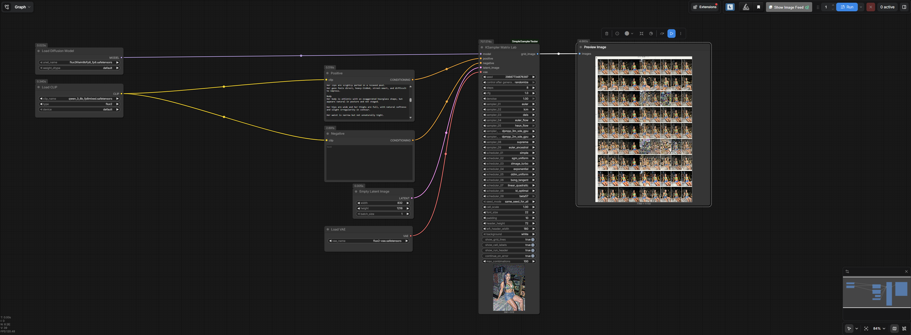

# ComfyUI KSampler Matrix Lab

ComfyUI KSampler Matrix Lab provides two custom nodes for visual benchmark grids:

- `KSampler Matrix Lab` compares sampler and scheduler combinations with one model.
- `Model Matrix Lab` compares multiple installed models with one sampler and scheduler.

Both nodes run tests sequentially and return one labeled `IMAGE` output that can be connected to `Preview Image` or `Save Image`.

## Features

- Compare sampler and scheduler combinations in a single grid.
- Dynamic sampler and scheduler dropdowns from the local ComfyUI installation.
- Up to 9 sampler slots and 9 scheduler slots.
- `None` option for unused sampler or scheduler slots.
- Sequential generation to avoid large all-at-once batches.
- Same-seed comparison mode.
- Increment-per-cell seed mode.
- Per-cell labels with sampler and scheduler names.
- Top run header with model, VAE, CLIP, steps, CFG, and denoise metadata.
- Error placeholder cells when `continue_on_error` is enabled.
- Safety limit for maximum combinations.
- Compare up to 20 checkpoints or standalone diffusion models.
- Automatically populated model dropdowns from local ComfyUI model folders.
- Shared prompt, sampler, scheduler, seed, steps, CFG, denoise, and latent for model comparisons.
- Configurable model grid column count.

## Screenshots

### Node



### Example Workflow



### Output Grid


## Installation

Clone this repository into your ComfyUI `custom_nodes` directory:

```bash
cd ComfyUI/custom_nodes
git clone https://github.com/btitkin/ComfyUI-KSampler-Matrix-Lab.git
```

Restart ComfyUI after installation.

## Nodes

The package adds:

```text
KSampler Matrix Lab
Model Matrix Lab
```

Category:

```text
ComfyUI-KSampler-Matrix-Lab
```

Output:

```text
IMAGE
```

## Included Workflow

The example workflow contains ready-to-use setups for both nodes:

```text
Workflows/KSamplerMatrixLab_Workflow.json
```

Drag the JSON file into ComfyUI or use `Workflow > Open` to load it.

## KSampler Matrix Lab Workflow

Use the node with a standard ComfyUI generation workflow:

```text
Load Checkpoint / model loader
CLIP Text Encode positive
CLIP Text Encode negative
Empty Latent Image
KSampler Matrix Lab
Preview Image or Save Image
```

Connect:

- `MODEL` to `model`
- positive conditioning to `positive`
- negative conditioning to `negative`
- latent to `latent_image`
- `VAE` to `vae`

## Model Matrix Lab

`Model Matrix Lab` compares installed models using the same generation settings and prompt text.

The node scans:

```text
ComfyUI/models/checkpoints
ComfyUI/models/unet
ComfyUI/models/diffusion_models
```

It provides model slots:

```text
model_01 ... model_20
```

Set unused slots to `None`. Model choices are labeled as either:

```text
checkpoint | filename
diffusion | filename
```

Checkpoint selections use their embedded CLIP and VAE when available. Standalone diffusion models require compatible external `CLIP` and `VAE` connections. These optional connections are also used as fallbacks when a checkpoint does not contain its own CLIP or VAE.

Use the text fields inside the node for the positive and negative prompts. This allows every checkpoint to encode the same text with its own text encoder.

Connect:

- `LATENT` to `latent_image`
- a compatible external `CLIP` to the optional `clip` input when required
- a compatible external `VAE` to the optional `vae` input when required

All selected models use the same:

- latent,
- seed,
- sampler,
- scheduler,
- steps,
- CFG,
- denoise.

The output is a configurable model comparison grid with the model source and filename above each cell. The optional top header shows the shared sampler, scheduler, steps, CFG, and denoise settings.

## Sampler and Scheduler Selection

The node provides dropdown slots:

```text
sampler_01 ... sampler_09
scheduler_01 ... scheduler_09
```

Set unused slots to:

```text
None
```

Duplicate sampler or scheduler selections are ignored after the first occurrence.

## Grid Layout

The final image grid uses:

- columns for schedulers,
- rows for samplers,
- generated images as cells,
- optional grid lines,
- repeated per-cell sampler/scheduler labels,
- an optional top metadata header.

The top metadata header includes:

```text
Model
VAE
CLIP
Steps
CFG
Denoise
```

Model, VAE, and CLIP names are inferred from the ComfyUI workflow when possible. Some custom loaders may not expose enough metadata, in which case the header may show `unknown`.

## Seed Modes

```text
same_seed_for_all
```

Uses the same seed for every cell. This is best for direct sampler/scheduler comparison.

```text
increment_per_cell
```

Uses `seed + cell_index` for each cell. This is useful for quick variation previews.

## Error Handling

When `continue_on_error` is enabled, a failed sampler/scheduler combination or model produces an error placeholder cell and the rest of the matrix continues.

When disabled, the node stops on the first failed test.

## Notes

- Generation is sequential by design.
- Very large grids can use significant RAM during final image composition.
- If the input latent batch size is greater than 1, the first decoded image is used for each grid cell.
- Full behavior depends on the samplers and schedulers available in the local ComfyUI installation.

## License

MIT
