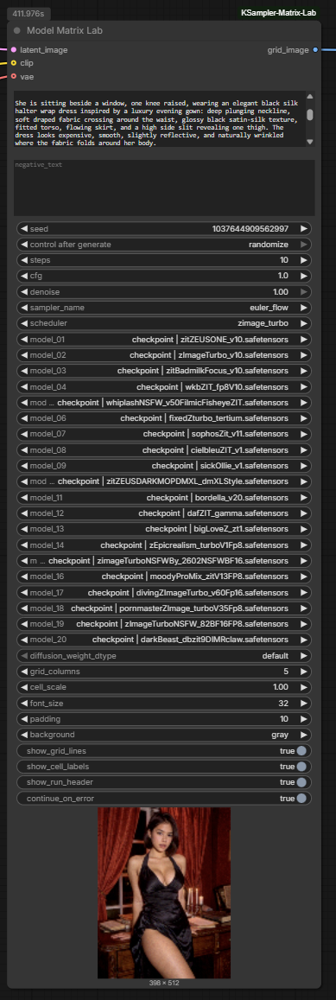

# ComfyUI KSampler Matrix Lab

ComfyUI KSampler Matrix Lab adds custom ComfyUI nodes for generating labeled sampler, scheduler and model comparison grids so ComfyUI users can evaluate settings visually without building the grid by hand.

It is for artists, prompt testers and model evaluators who need side-by-side output comparisons inside a normal ComfyUI workflow.

## Preview

### KSampler Matrix Lab Node


### Example Workflow


### Sampler / Scheduler Output Grid


### Model Matrix Lab Node



### Model Output Grid


## Features

- `KSampler Matrix Lab` node for sampler and scheduler comparison grids.
- `Model Matrix Lab` node for comparing multiple installed checkpoints or diffusion models.
- Dynamic sampler and scheduler dropdowns from the local ComfyUI installation.
- Up to 9 sampler slots and 9 scheduler slots.
- Up to 20 model slots for model comparisons.
- `None` options for unused slots.
- Sequential generation to avoid large all-at-once batches.
- Same-seed and increment-per-cell seed modes.
- Per-cell labels and optional top metadata header.
- Error placeholder cells when `continue_on_error` is enabled.
- Safety limit for maximum combinations.
- Included example workflow JSON.

## Installation

Clone the repository into ComfyUI's `custom_nodes` directory:

```bash
cd ComfyUI/custom_nodes
git clone https://github.com/btitkin/ComfyUI-KSampler-Matrix-Lab.git
```

Restart ComfyUI after installation.

Installation instructions are based on the current repository structure and should be verified in your local ComfyUI environment.

## Quick Start

1. Install the repository into `ComfyUI/custom_nodes`.
2. Restart ComfyUI.
3. Add either `KSampler Matrix Lab` or `Model Matrix Lab` from the `ComfyUI-KSampler-Matrix-Lab` category.
4. Connect the node to a normal generation workflow.
5. Send the single `IMAGE` output to `Preview Image` or `Save Image`.

Included workflow:

```text
Workflows/KSamplerMatrixLab_Workflow.json
```

Drag the JSON file into ComfyUI or open it through ComfyUI's workflow menu.

## Examples / Use Cases

- Compare sampler and scheduler combinations with one prompt, model, seed and latent.
- Compare checkpoints or standalone diffusion models with shared generation settings.
- Produce visual grids for model notes, prompt tests or art-direction reviews.
- Keep failed combinations visible in the output grid while continuing the rest of the run.

## Roadmap

- More example workflows.
- Clearer compatibility notes for custom model loaders.
- Additional output-layout options if they prove useful in real ComfyUI use.

## Status

Usable: the repository contains ComfyUI node mappings, an example workflow and preview images. Runtime behavior still depends on the user's ComfyUI version, installed models, samplers and custom nodes.

## License

MIT. See [LICENSE](./LICENSE).

